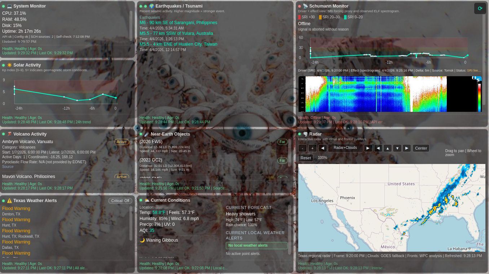
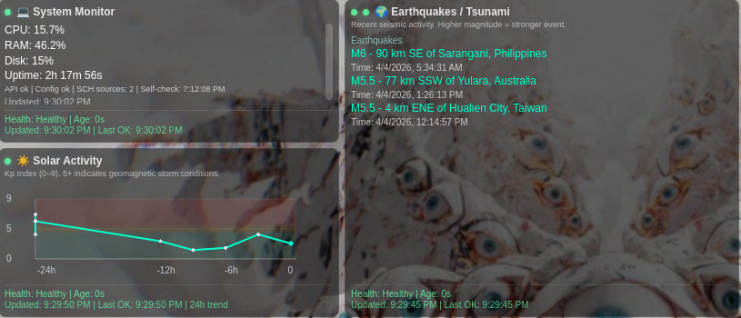
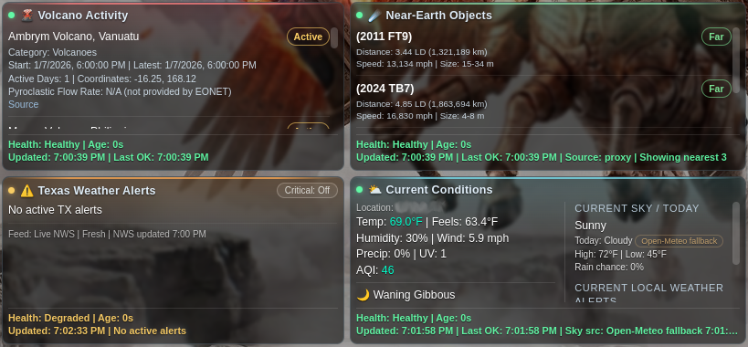
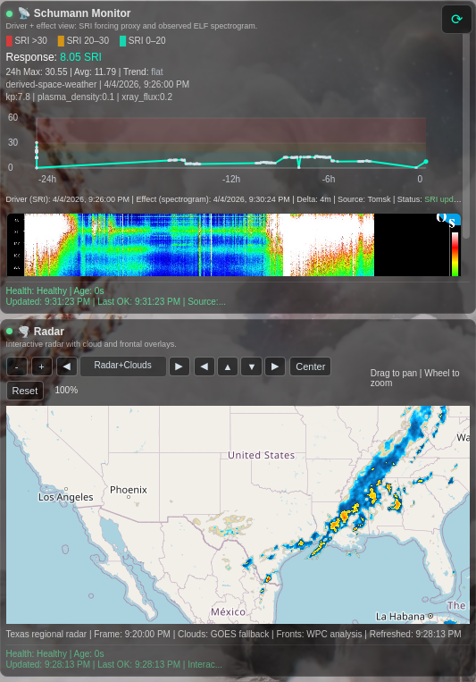

# Mission Control Dashboard

A local situational-awareness dashboard with a static frontend and a Flask API proxy.

## Features

- System telemetry: CPU, memory, disk, uptime
- Earthquakes and critical tsunami alerts
- Solar activity: Kp index and solar wind plasma context
- Schumann response widget with strict source separation
- Volcano activity details from EONET
- Weather, AQI, local forecast summary, and severe weather alerts
- Interactive radar with pan/zoom, cloud layer, and surface fronts overlay
- Persistent 24-hour trend history across restarts

## Dashboard Preview

Full dashboard view:



Widget snapshots:





Note: `weather.png` intentionally blurs the local city for privacy.

## Requirements

- Python 3.10+
- A local static file server for `dashboard.html`
- Internet access for the public upstream APIs

## Project Layout

- `dashboard.html`: frontend dashboard
- `system_api.py`: local Flask proxy/API layer
- `schumann_adapter.py`: Schumann payload normalizer
- `.env.example`: backend environment template
- `config.example.json`: frontend runtime config template
- `data/`: persisted trend history and optional local Schumann fallback
- `scripts/export_sanitized.sh`: rebuilds the shareable sanitized copy

## Install (Linux)

1. Clone the repo and enter it.

```bash
git clone <YOUR_REPO_URL>
cd Master-Control-Dashboard-Wallpaper
```

2. Ensure Python venv support is installed.

```bash
sudo apt update
sudo apt install -y python3 python3-venv
```

3. Create and activate a virtual environment.

```bash
python3 -m venv .venv
source .venv/bin/activate
```

4. Install Python dependencies.

```bash
pip install -r requirements.txt
```

5. Create local backend config.

```bash
cp .env.example .env
```

6. Create local frontend config.

```bash
cp config.example.json config.local.json
```

## Configuration

### Backend config: `.env`

Available keys:

- `DASHBOARD_API_HOST`: Flask bind host. Default `127.0.0.1`
- `DASHBOARD_API_PORT`: Flask bind port. Default `5000`
- `CORS_ALLOWED_ORIGINS`: comma-separated frontend origins allowed to call the API
- `NASA_API_KEY`: optional NASA API key. `DEMO_KEY` works with rate limits
- `SCHUMANN_API_URL`: optional real-time Schumann JSON source
- `SCHUMANN_API_URLS`: optional comma-separated Schumann JSON sources (priority order)
- `SCHUMANN_VALUE_PATH`: optional dot-path to the numeric value inside a custom Schumann payload
- `SCHUMANN_DERIVED_ENABLED`: when enabled (default), computes a live derived Schumann Response Index from NOAA feeds when direct Schumann source is missing

### Frontend config: `config.local.json`

Set these values for your local install:

- `location.label`: display label for the weather widget
- `location.lat` and `location.lon`: weather/AQI coordinates
- `radar.lat`, `radar.lon`, `radar.zoom`, `radar.tileRadius`: radar viewport settings
- `radar.frontsImage`: optional URL for frontal-analysis overlay image (default uses WPC)
- `visuals.backgroundImages`: array of background image paths

## Run

Start the backend API:

```bash
python3 system_api.py
```

In a second terminal, serve the frontend folder:

```bash
python3 -m http.server 8080
```

Then open:

```text
http://localhost:8080/dashboard.html
```

The frontend talks to the Flask API on `http://127.0.0.1:5000` unless overridden in the app config.

## Linux Auto-Start (At Boot/Login)

Use `systemd --user` services so the backend and static frontend server come up automatically.

1. Create user service files.

```bash
mkdir -p ~/.config/systemd/user
```

Create `~/.config/systemd/user/mission-dashboard-api.service`:

```ini
[Unit]
Description=Mission Control Dashboard API (Flask)
After=network-online.target
Wants=network-online.target

[Service]
Type=simple
WorkingDirectory=%h/Master-Control-Dashboard-Wallpaper
EnvironmentFile=%h/Master-Control-Dashboard-Wallpaper/.env
ExecStart=%h/Master-Control-Dashboard-Wallpaper/.venv/bin/python %h/Master-Control-Dashboard-Wallpaper/system_api.py
Restart=on-failure
RestartSec=5

[Install]
WantedBy=default.target
```

Create `~/.config/systemd/user/mission-dashboard-web.service`:

```ini
[Unit]
Description=Mission Control Dashboard Frontend (HTTP Server)
After=network-online.target
Wants=network-online.target

[Service]
Type=simple
WorkingDirectory=%h/Master-Control-Dashboard-Wallpaper
ExecStart=%h/Master-Control-Dashboard-Wallpaper/.venv/bin/python -m http.server 8080
Restart=on-failure
RestartSec=5

[Install]
WantedBy=default.target
```

If the repo directory name is different on another machine, replace `%h/Master-Control-Dashboard-Wallpaper` in both service files with the actual absolute path.

2. Enable and start both services.

```bash
systemctl --user daemon-reload
systemctl --user enable --now mission-dashboard-api.service
systemctl --user enable --now mission-dashboard-web.service
```

3. Check status and logs.

```bash
systemctl --user status mission-dashboard-api.service
systemctl --user status mission-dashboard-web.service
journalctl --user -u mission-dashboard-api.service -f
```

4. Optional: start services even before user login (true boot start).

```bash
sudo loginctl enable-linger "$USER"
```

Without linger, `systemd --user` services start at user login, which is usually what desktop installs want.

5. Optional: auto-open dashboard in desktop session.

Create `~/.config/autostart/mission-dashboard.desktop`:

```ini
[Desktop Entry]
Type=Application
Name=Mission Control Dashboard
Exec=xdg-open http://localhost:8080/dashboard.html
X-GNOME-Autostart-enabled=true
```

## Schumann Response Setup

The Schumann widget supports three source modes in priority order:

1. `SCHUMANN_API_URL` / `SCHUMANN_API_URLS` endpoints (first endpoint with a numeric value wins)
2. Derived live index mode from NOAA Kp + solar-wind plasma + GOES X-ray (`SCHUMANN_DERIVED_ENABLED=1`)
3. Local fallback file `data/schumann_response.json`

You can still create `data/schumann_response.json` as a hard fallback source.

Example local fallback file:

```json
{
  "value": 12.3,
  "unit": "a.u.",
  "observed_at": "2026-04-03T12:34:56Z",
  "source": "my-source"
}
```

The backend uses `schumann_adapter.py` to normalize flat payloads, nested objects, and simple timeseries arrays. If your upstream JSON uses a custom field path, set `SCHUMANN_VALUE_PATH`, for example:

```text
data.current.value
```

If remote and derived sources fail or return incompatible payloads, the backend falls back to `data/schumann_response.json` when available.

## Persistence

- Trend history is written to `data/trend_history.json`
- The frontend restores persisted history through `/trend-history`
- This file is local runtime state and should not be committed

## Troubleshooting

- Weather offline: verify `location.lat` and `location.lon` in `config.local.json`
- Frontend cannot reach backend: confirm Flask is running on the host/port from `.env`
- Empty Schumann widget: configure `SCHUMANN_API_URL` or provide `data/schumann_response.json`
- CORS errors: add your frontend origin to `CORS_ALLOWED_ORIGINS`

## Security Notes

- The API binds to `127.0.0.1` by default
- CORS defaults to localhost-only origins
- No elevated privileges or sudo access are required

## Create Sanitized Shareable Copy

To rebuild the shareable sanitized export without touching your working copy:

```bash
bash scripts/export_sanitized.sh
```

Output:

```text
sanitized-template/
```

## Publishing Note

If you publish the sanitized copy, publish the contents of `sanitized-template/` rather than the live working files in the project root.
